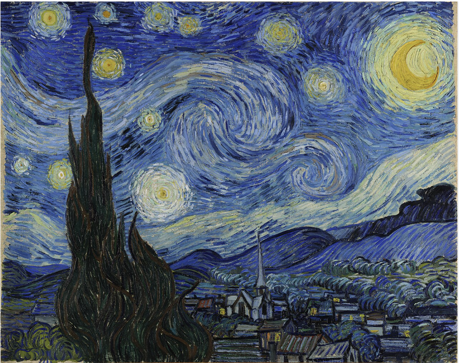
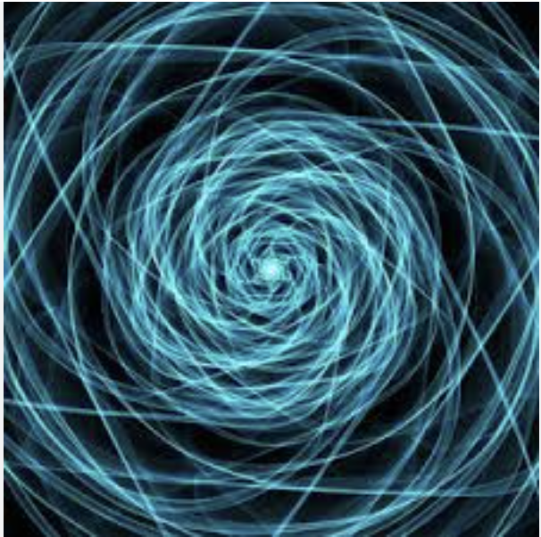
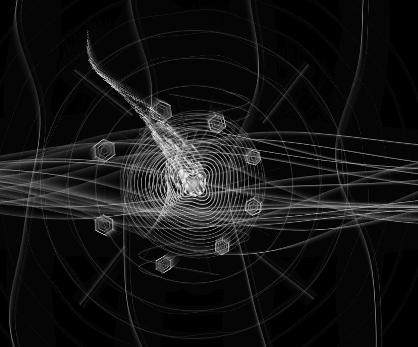

# Quiz 8

## Part 1: Imaging Technique Inspiration

### Example: Swirling Vortex Effect

I am inspired by the swirling vortex effect seen in Van Gogh’s Starry Night and geometric spiral patterns. The flowing, circular movement creates a strong sense of emotion and energy. I would like to incorporate this visual language into my project to represent dynamic emotional changes. This technique is beneficial because it adds movement, depth, and atmosphere, which fits well with the assignment’s focus on interaction and animation.

## Part 2: Coding Technique Exploration

### Technique: Particle Flow System

A useful coding technique for creating the swirling vortex effect is a particle flow system. In this example, particles move through a noise-driven field and leave soft fading trails behind them. This can create a fluid, circular motion similar to the swirl patterns in my visual references. This technique could help my project because it can make the image feel more dynamic, emotional, and immersive.

Example code:  
https://codepen.io/VoXelo/pen/LEGdOPM?anon=true&view=pen